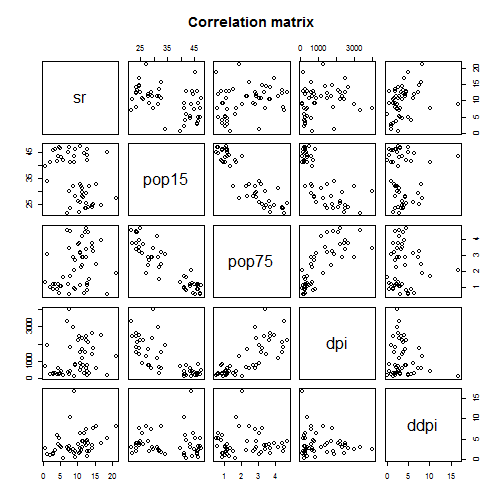

## Exploring data
We can not conclude anything from the plot

```r
pairs(~.,data=LifeCycleSavings, 
   main="Correlation matrix")
```

 


---
## Regression model


```r
fit<- lm(sr~., data=LifeCycleSavings)
summary(fit)$coefficients
```

```
##                  Estimate   Std. Error    t value     Pr(>|t|)
## (Intercept) 28.5660865407 7.3545161062  3.8841558 0.0003338249
## pop15       -0.4611931471 0.1446422248 -3.1885098 0.0026030189
## pop75       -1.6914976767 1.0835989307 -1.5609998 0.1255297940
## dpi         -0.0003369019 0.0009311072 -0.3618293 0.7191731554
## ddpi         0.4096949279 0.1961971276  2.0881801 0.0424711387
```


---
## Which variable coefficient's are significantly different from 0?


<br/>
-pop15 and ddpi
</br>
-explanation Pr(>|t|)<<0.5%


